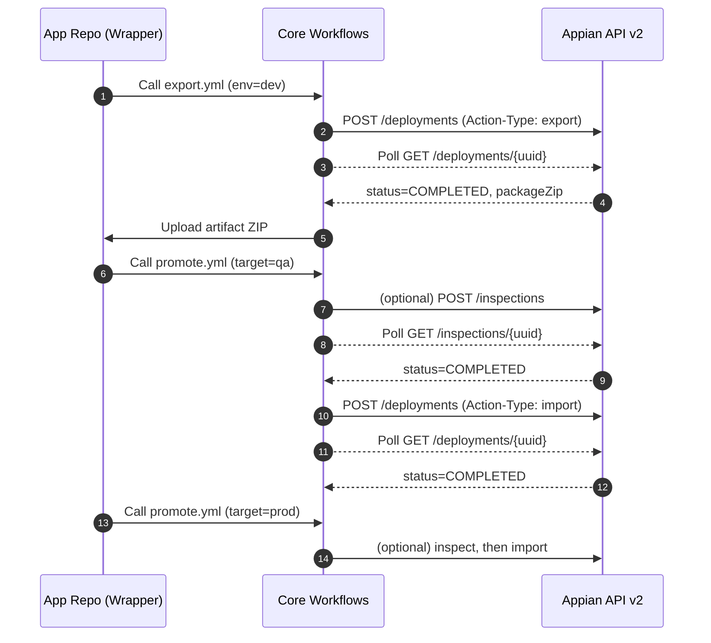
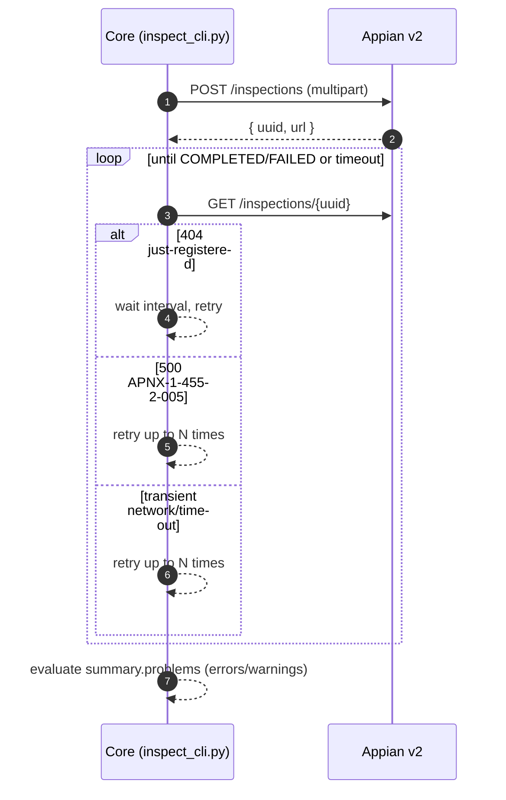
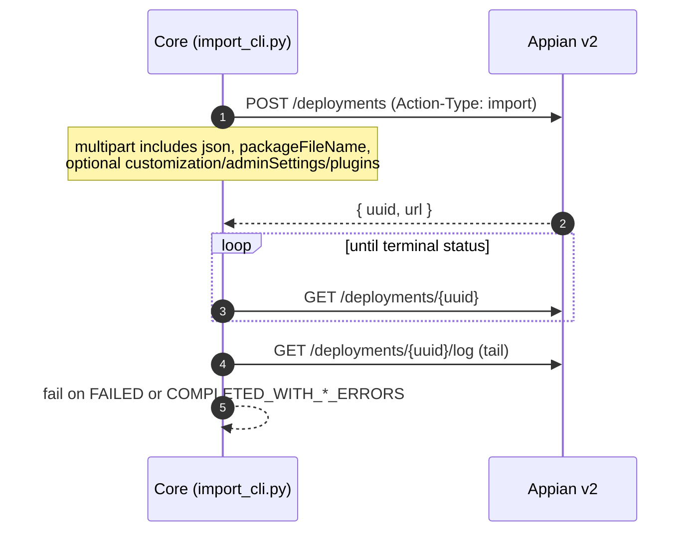

# Architecture

This Core repo provides a centralized integration to Appian Deployment Management v2. It supports a two‑repository model where application code lives in app‑specific repos, while promotion mechanics and API logic live here.

Two‑repo model
- App repo: owns the application, packaging logic, and invokes reusable workflows from the Core via `workflow_call`.
- Core repo (this): exposes reusable workflows, composite actions, and CLIs that encapsulate Appian API calls, polling, retries, and error handling.

Boundaries and configuration
- Base URLs: `.github/actions/_config/appian_base_urls.env`.
- Action behavior: `.github/actions/_config/appian_promote.env`.
- Secrets: injected by the caller repo’s environment via GitHub Secrets (`APPIAN_*_API_KEY`).
- API clients: pure Python in `.github/actions/appian-promote/*.py` and `.github/actions/appian-export/appian_cli.py`.

## Flow: Dev → QA → Prod

## Flow: Inspection + Polling (Retries/Backoff)

Implementation references
- Inspect POST: `.github/actions/appian-promote/inspect_cli.py:19`
- Inspect GET: `.github/actions/appian-promote/inspect_cli.py:41`
- Retry handling and status evaluation: `.github/actions/appian-promote/inspect_cli.py:72`

## Flow: Import (Options)

Notes
- Common import options like deleteMissing are not sent by the current Core. They can be added via the JSON portion of the multipart if required by your governance; diagram shows options as a future extension.

Implementation references
- Import POST: `.github/actions/appian-promote/import_cli.py:24`
- Deployment GET: `.github/actions/appian-promote/import_cli.py:73`
- Log GET: `.github/actions/appian-promote/import_cli.py:80`
- Status handling: `.github/actions/appian-promote/import_cli.py:133`

