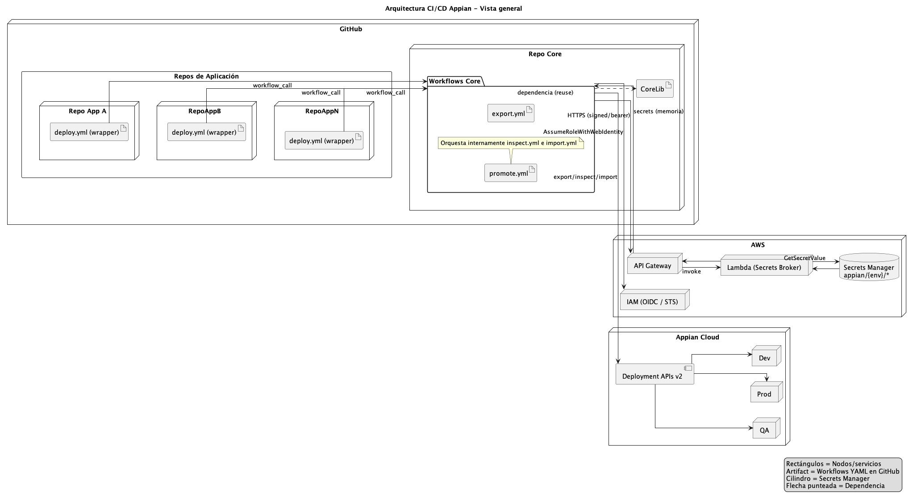

# Arquitectura CI/CD para Apps Appian

> **Resumen:** Orquestamos despliegues de múltiples aplicaciones Appian desde GitHub.
> Cada aplicación tiene su **repo propio** (basado en **template**), que invoca **workflows core** alojados en este **Repo Core**.
> Los secretos (API keys) se administran a nivel de organización en GitHub.

---

## 0) Imagen de Arquitectura

### Explicación del Diagrama

El diagrama ilustra la interacción entre los principales componentes de la arquitectura:

- **GitHub:** Plataforma central que aloja tanto los repositorios de las aplicaciones como el repositorio Core con los workflows compartidos.
- **Repo Core:** Almacena y gestiona los workflows centrales que orquestan los despliegues y procesos CI/CD de las aplicaciones Appian, garantizando consistencia y reutilización. Si se solicita exportar un **package**, el Core resuelve dinámicamente el UID del paquete partiendo del UID de la aplicación, evitando hardcodear identificadores.
- **Appian Cloud:** Entornos de origen y destino (Dev, QA, Prod) donde se exportan e importan las aplicaciones Appian.

---

## 1) Descripción de la Arquitectura

La arquitectura facilita la gestión y despliegue de múltiples aplicaciones Appian de forma centralizada. Cada aplicación posee su propio repositorio basado en un template estándar que contiene configuraciones específicas y objetos versionados.

Los repositorios de aplicaciones invocan workflows definidos en este repositorio Core, que centraliza la lógica de CI/CD. Esto permite reutilizar procesos y mantener consistencia en los despliegues.

Toda la orquestación se realiza únicamente con GitHub Actions. Las credenciales sensibles se manejan mediante GitHub Secrets a nivel de organización, evitando exponerlas en repositorios.

---

## 2) Repositorios de Aplicaciones

Cada aplicación Appian cuenta con un repositorio propio que estandariza estructura y configuración. En estos repositorios no se almacena código fuente tradicional, sino:

- Archivos `.zip` que contienen los objetos Appian exportados.
- Archivos de configuración específicos de la aplicación.
- Referencias para invocar los workflows del Repo Core.
- Template del archivo `.properties` para parametrización (sin incluir valores reales ni secretos).

Bajo el concepto de **release**, cada despliegue exitoso encapsula los datos y objetos exportados en un artefacto versionado, garantizando trazabilidad de qué se desplegó y cuándo.

---

## 3) Manejo de archivos `.properties`

Los `.properties` se tratan como **archivos desechables y dinámicos**, asegurando que no dejen trazabilidad persistente en repositorios ni en históricos. Su objetivo es parametrizar el despliegue en tiempo de ejecución, usando únicamente **GitHub Secrets** y **Variables de Environment** como fuente de datos.

**Flujo de trabajo:**

1. **Export (Dev)** → El Core obtiene el template del export (app o package) y detecta las llaves requeridas.
2. **Sync/Validate (target env)** → El Core lee, en el *Environment* correspondiente del repo de la app:
   - **Variables:** `APP_PROPS_PUBLIC_JSON`
   - **Secrets:** `APP_PROPS_SENSITIVE_JSON`
   Luego compara ambas contra las llaves requeridas.
3. **Si faltan llaves**:
   - El job publica un resumen (Job Summary) con la lista y crea un *Issue* con checklist.
   - El job queda bloqueado esperando el **approval del Environment** (QA/Prod).
   - Antes de aprobar, el usuario edita en GitHub los valores de `APP_PROPS_PUBLIC_JSON` y/o `APP_PROPS_SENSITIVE_JSON` para completar lo faltante.
   - Una vez guardado, se aprueba el Environment y el job continúa.
4. **Build** → El Core construye `app.properties` en **runtime** (merge de PUBLIC_JSON + SENSITIVE_JSON + overrides) y continúa con la importación.

**Ventajas del enfoque:**
- No se almacena ningún `.properties` sensible en el repo ni en histórico.
- Los valores se solicitan solo cuando son necesarios y se eliminan al final del proceso.
- El pipeline no falla por llaves faltantes: queda en espera controlada hasta completar la información.

---

## 4) Estimación de Esfuerzo y Refactor

Para adoptar esta arquitectura se requiere un refactor significativo:

### Estimación de Esfuerzo (horas de desarrollo y pruebas)

#### **Fase única – Refactor estructural y centralización en Repo Core**
- Análisis y levantamiento de arquitectura actual: **6 h**
- Diseño y ajuste de template de repos de aplicaciones: **8 h**
- Refactor de workflows y modularización (export/promote): **18 h**
- Ajuste de manejo de `.properties` desechables y validaciones: **10 h**
- Pruebas de integración end‐to‐end (Dev → QA → Prod): **12 h**
- Documentación y capacitación interna: **6 h**

**Subtotal:** **60 h**

Este esfuerzo permitirá mejorar la escalabilidad, seguridad y mantenibilidad de los procesos CI/CD para las aplicaciones Appian.
